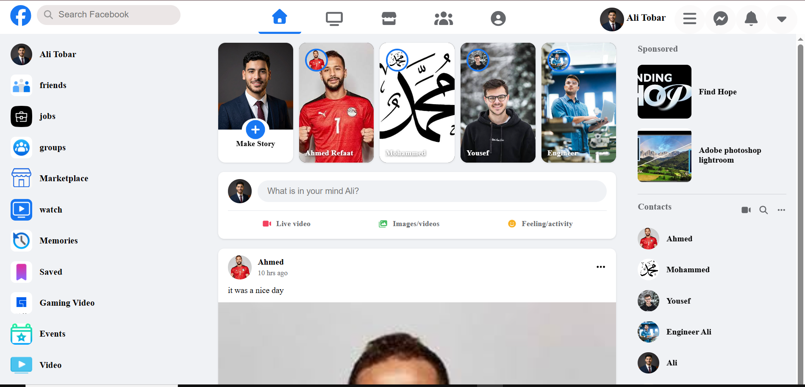

# Facebook Clone — Interactive & Responsive UI

A fully responsive Facebook interface clone featuring dynamic client-side interactions, multi-page layout (Feed, Login, and Account Creation), built using semantic HTML5, modern CSS3, and Vanilla JavaScript.

---

## 🔗 Live Demo & Links

- **Live Demo:** [View Live Site](https://ali-tobar.github.io/Facebook-Clone/)
- **Source Code:** [GitHub Repository](https://github.com/Ali-Tobar/Facebook-Clone)

---

## 📸 Preview



---

## ✨ Features

### 🎨 UI & Layout
- **Multi-Screen Responsiveness:** Fully adaptive layouts designed for Mobile, Tablet, and Desktop using CSS Media Queries.
- **Top Navigation Bar:** Includes Facebook branding, search input layout, navigation tabs, and profile access icons.
- **Left Sidebar:** Quick navigation shortcuts with custom hover states and transitions.
- **Stories Bar:** Interactive horizontal scrolling section displaying user stories.
- **News Feed:** Post cards with structured headers, author avatars, media containers, and reaction sections.

### ⚡ Interactivity & Logic (Vanilla JavaScript)
- **Multi-Page Navigation:** Separate interactive views for user Feed, Login, and Registration pages.
- **Form Handling:** Client-side input management for login and registration forms (`login.js` & `CreateAccount.js`).
- **DOM Manipulation:** Dynamically structured and interactive elements for UI states.

---

## 🛠️ Built With

- **HTML5:** Semantic architecture (`<header>`, `<nav>`, `<main>`, `<section>`, `<article>`).
- **CSS3:** Flexbox layout system, CSS Variables (Custom Properties), and responsive Media Queries.
- **JavaScript (ES6+):** DOM selection, event listeners, form handling, and interactive UI logic.
- **FontAwesome:** Scalable vector icons.

---

## 📂 Project Structure

```text
Facebook-Clone/
├── images/              # Assets, icons, and UI preview images
├── index.html           # Main News Feed page
├── main.css             # Main feed styles & layout
├── login.html           # Facebook Login view
├── login.css            # Styles for login screen
├── login.js             # Logic for authentication form
├── createAccount.html   # Account registration page
├── CreateAccount.css    # Registration styles
├── CreateAccount.js     # Registration validation & interactions
└── README.md            # Project documentation
